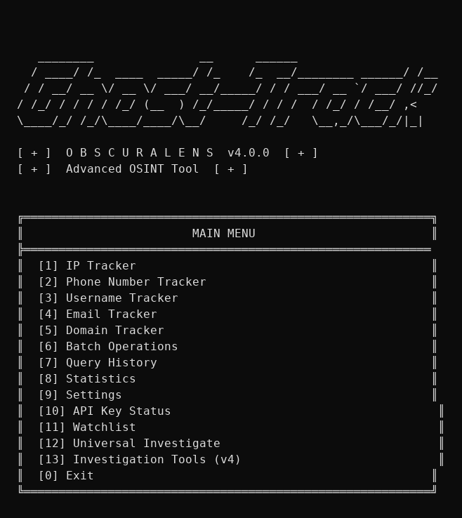
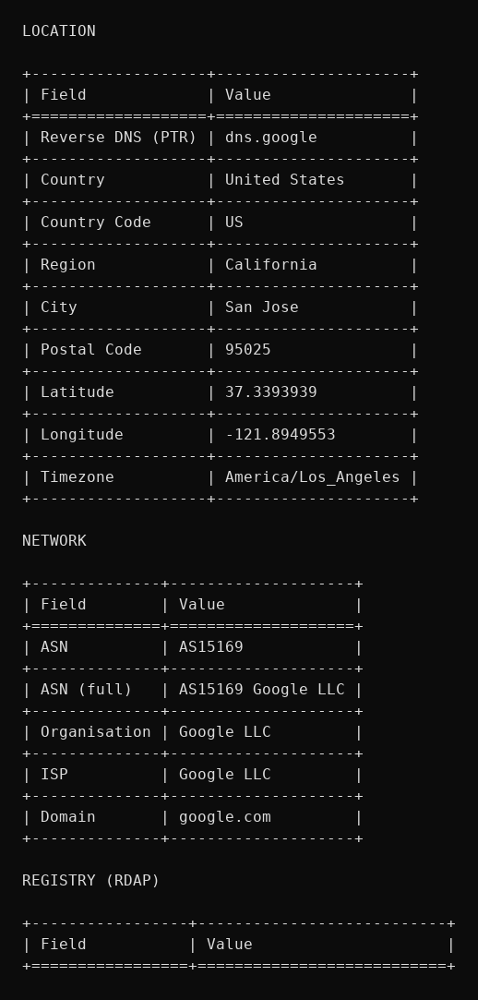
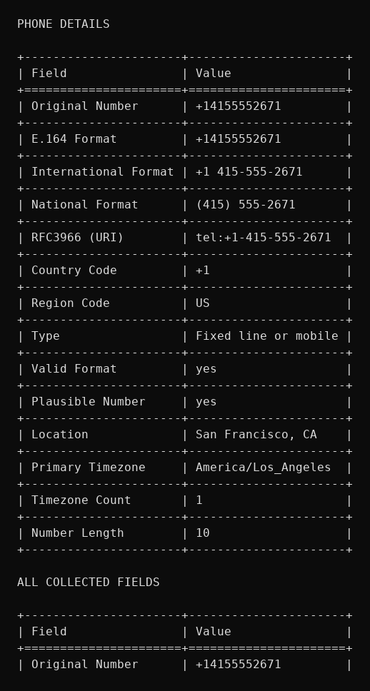
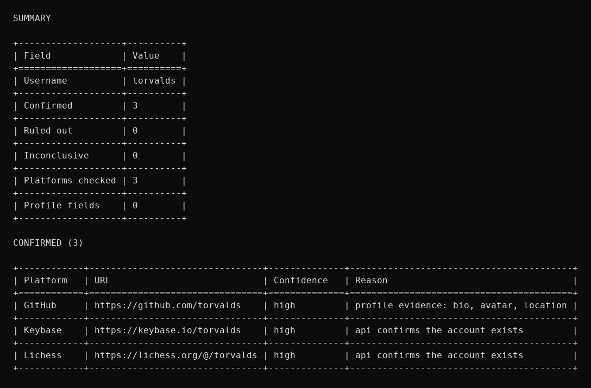

# ObscuraLens v6.2 — Sensors, Analytics & Ecosystem

> **Founder & maintainer:** MJH

<div align="center">

**Download the Desktop Beta (single-file Windows exe — no Python required):**

[](https://github.com/AceGuru-mjh/obscuralens/releases)

macOS and Linux binaries ship with every beta release too.

</div>

Multi-source OSINT console and investigation platform for **20 target kinds**: IP addresses, phone numbers, usernames, email addresses, domains, URLs, crypto addresses, file hashes, CVEs, AS numbers, MAC addresses, IBANs, IMEIs, geographic coordinates, VINs, flight numbers, maritime MMSIs, software packages, WiFi BSSIDs and license plates. Every lookup fans out to all available data sources in parallel, merges the fields, tracks **which source supplied each fact**, and scores **how well each fact is corroborated** (noisy-OR evidence confidence over a curated source-trust table) — no silent single-source lookups, no false-positive "hits". v6.2 completes the six-part v6.0 programme: **Part 1** grew the sensor matrix to 20 kinds (VINs, flight designators, MMSIs, software packages, WiFi BSSIDs, license plates); **Part 2** added a ten-module pure-stdlib analytics package; **Part 3** expanded the web UI with five new views, an offline world map and live SSE; **Part 4** shipped the notification centre, task scheduler and STIX 2.1 / MISP exports; **Part 5** was the ecosystem release — Python SDK v6 with a fluent `InvestigationSession`, a dependency-free TypeScript SDK, a 63-tool MCP server, Plugin SDK v2 and shell completions; **Part 6** landed the benchmark suite (with committed baselines), a 1,300-case test expansion and the full documentation set (architecture, contributing, security). v6.1 added evidence-confidence scoring, a search-dork builder across 13 kinds, three new blockchains (TRON/NEAR/ATOM, 7 → 10 chains) and 17 new live-verified keyless sources; v5.2 doubled the username sweep to **104 platforms** (now 112) and cut cache latency 25-75x; v5.1 shipped the Desktop Beta; v5.0 added the analyst toolbox, web UI and launcher; v4.0 layered the investigation workflow (pivots, correlation, timelines, risk scoring, cases, pipelines). See [docs/sources.md](docs/sources.md) for the full source catalog.

## What's new in v6.2 (Quality, Benchmarks & Docs)

- **Benchmark suite** (`benchmarks/`): 70 offline benchmarks across three groups — core (validators, cache, rate limiter, coordinate maths, dorks, data catalog), analytics (stats, anomaly detection, clustering, similarity, text metrics, graph metrics, forecasting on synthetic data up to 10k points) and platform (MCP marshalling, SDK URL/model work, report rendering, STIX/MISP export, plugin loading, completions, i18n, database) — with a deterministic timing harness (min/median/p95/ops-per-sec), a **committed baseline** (`benchmarks/results/baseline.json`), tolerance-based regression comparison (35% band for CI machine variance), a CI-safe `--quick` mode and `--fail-on-regression` gating. Run `make bench`, `python -m benchmarks.run`, or `just bench-quick`. See [docs/benchmarks.md](docs/benchmarks.md).
- **Test expansion (+1,319 cases, 3,267 → 4,586)**: the barely-tested modules now have deep offline suites — `advanced/batch`, `advanced/alerts`, `advanced/patterns` (13-14% → 85%+), `advanced/geospatial` (16% → 99%), `advanced/report_builder` (11% → 100%), `utils/coordinate_math` (19% → 99%), `reporting/sections` (31% → 97%), `visualization/charts` (→ 100%) and the interactive CLI console (`cli.py` → 98%), including round-trip anchors for every coordinate format (UTM/MGRS/geohash/Maidenhead/DMS) and full SVG-report coverage. Two real bugs found and fixed along the way: the Makefile used spaces instead of tabs (every `make` target was broken), and `build_history_report` crashed on records without parseable timestamps.
- **Documentation set**: [docs/architecture.md](docs/architecture.md) — the definitive internals guide (layer map, life-of-a-lookup walkthrough, state & storage, concurrency model, the 20-kinds source matrix, extension surfaces); [CONTRIBUTING.md](CONTRIBUTING.md) — setup, workflow, code style, and step-by-step guides for adding a source, a target kind, an MCP tool or a benchmark; [SECURITY.md](SECURITY.md) — vulnerability disclosure, OPSEC stance, secrets handling, data sensitivity; [docs/index.md](docs/index.md) — the reading map by audience; [docs/benchmarks.md](docs/benchmarks.md); plus the rewritten [docs/plugins.md](docs/plugins.md) (Plugin SDK v2 contract) and [docs/ecosystem.md](docs/ecosystem.md) from part 5.
- **CI hardening**: two new jobs — `benchmarks` (quick-mode suite + contract tests against the committed baseline) and `sdk-js` (the TypeScript SDK's 78 node:test cases on Node 22) — alongside the existing lint/test-matrix/sanity/web/tui/docker/desktop/release jobs.

## What's new in v6.1 (Corroboration & Coverage)

- **Evidence confidence scoring on every lookup**: each field carries a noisy-OR corroboration score built from its provenance — two independent sources compound above either alone, five aggregators still cannot outvote one authoritative record. A curated trust table rates offline standards maths (0.95), first-party records like registries/chain RPCs/PeeringDB/CAIDA (0.9), aggregators (0.75). Shown as an EVIDENCE CONFIDENCE section in reports, a `confidence` block in JSON/web/MCP, and per-field scores in the investigate graph.
- **Three new blockchains (7 → 10)**: TRON via TronGrid, NEAR named accounts (`alice.near`) via the public RPC, ATOM via the cosmos.directory REST proxy — plus cross-chain enrichment for ETH addresses (Avalanche C-chain balance/nonce, Ethplorer ERC-20 token portfolio) and an independent second XRP opinion from the xrplcluster.com community RPC.
- **17 new keyless sources, all live-verified**: CISA KEV exploited-in-the-wild verdicts for CVEs (via CISA's own GitHub mirror), proxycheck.io VPN/proxy/risk for IPs, XposedOrNot breach analytics for emails, HSTS-preload status and ransomware.live leak-site victim checks for domains, CAIDA AS-Rank + PeeringDB for ASNs, adsb.lol **live flight positions** (first keyless live-flight source), Open-Meteo weather + elevation cross-check for coordinates.
- **Username sweep 104 → 112 platforms**: Calendly, Gumroad, OpenSea, Bandcamp (clean 200/404 splits), Ko-fi and Codeforces (title-signature rules), Stack Exchange (users API, exact display-name match) and Duolingo (users JSON API).
- **Search-dork builder**: `obscuralens dorks <target>` (also a web toolbox tab and an MCP tool) generates ready-to-open Google/Bing/DDG/Yandex/GitHub links per kind — domain exposed-file hunting, email leak context, CVE exploit hunting. Link generation is local-only; the analyst stays in control of every active query.
- **Performance**: every source fan-out honours `max_workers` (the hardcoded 12-thread cap is gone from all 17 modules), and fragile community APIs (ethplorer, ransomware.live, adsb.lol, chain RPCs) get their own slower rate-limit buckets so parallel sweeps cannot trip their 429s.

## What's new in v6.0 (Sensors & Analytics — complete)

- **Part 1 — sensor matrix 14 → 20 kinds**: vehicle VINs (ISO 3779 decode + NHTSA vPIC), flight designators (offline IATA/ICAO airline pack + live status), maritime MMSIs (ITU-R M.1085 classes + MID flag pack), software packages (pypi/npm/crates/docker/github + OSV.dev CVEs), WiFi BSSIDs (offline IEEE OUI + WiGLE) and license plates (79 national formats) — each with validators, rules, data packs and full CLI/web/MCP registration.
- **Part 2 — analytics package**: a new `obscuralens.analytics` layer (10 modules, pure stdlib, ~7,500 lines) for statistics, time-series trend/changepoint workups, anomaly detection (z-score / IQR / MAD / Grubbs / ensemble), clustering (DBSCAN / k-means / hierarchical), string similarity, text metrics with language/script fingerprinting, investigation-graph metrics, spatial analytics, screening models and query-history enrichment — wired into a new `obscuralens analytics` CLI group, nine `/api/analytics/*` REST endpoints and seven `analytics_*` MCP tools (47 total). See [docs/analytics.md](docs/analytics.md).
- **Part 3 — web UI expansion**: five new single-page views (analytics, map, compare, profile, monitor), an offline world map, nine advanced canvas chart types and live server-sent-events updates.
- **Part 4 — automation & sharing**: a multi-channel notification centre (webhook / Telegram / Discord / Slack / SMTP, each with event subscriptions, severity floors, local quiet hours and a 5-minute dedup window), a cron-shaped task scheduler (interval/daily/weekly; watchlist re-checks, YAML pipelines, history reports, feed refreshes, channel probes; daemon tick loop), deterministic STIX 2.1 bundle and MISP core-format event exports built from stored lookups, and new `notify`/`export` pipeline steps — wired into the `notify`/`automation` CLI groups, 14 REST endpoints and five MCP tools. See [docs/automation.md](docs/automation.md).
- **Part 5 — ecosystem**: the Python SDK grows to full v6 coverage (all 20 kind lookups, nine analytics methods, six notification and six automation methods, STIX/MISP exports, the dork builder and a fluent `InvestigationSession` workflow API, mirrored across sync and async clients, +5,500 lines with 142 offline tests); a brand-new **TypeScript/JavaScript SDK** (`sdk-js/`, zero npm dependencies, strict-mode clean, 78 node:test cases, ships compiled `dist/` + `.d.ts`); the **MCP server grows 53 → 63 tools** (MISP export, geo-clustering, trend + forecast, history search, watch and case management, offline data-pack lookups); a **Plugin SDK v2** (commands, report sections, MCP tools and analytics hooks beyond data sources, with `PLUGIN_META` manifests, an isolated `plugins check` linter, `plugins run` dispatch and three shipped example plugins); and **bash/zsh/fish shell completions** generated from the live CLI parser (`obscuralens completion bash|zsh|fish`). See [docs/ecosystem.md](docs/ecosystem.md).
- **Part 6 — quality, benchmarks & docs**: a 70-benchmark offline suite (`benchmarks/`) with a deterministic timing harness, committed baselines and tolerance-based regression comparison (`make bench` / `--quick` / `--fail-on-regression`); a **+1,319-case test expansion** (3,267 → 4,586) lifting the weakest modules — `advanced/report_builder` 11% → 100%, `advanced/geospatial` 16% → 99%, `utils/coordinate_math` 19% → 99%, `reporting/sections` 31% → 97%, `visualization/charts` → 100%, the interactive console → 98% — with two real bugs found and fixed (the Makefile's spaces-not-tabs recipes, and a history-report crash on timestamp-less records); the documentation set ([architecture](docs/architecture.md), [CONTRIBUTING](CONTRIBUTING.md), [SECURITY](SECURITY.md), [docs index](docs/index.md), [benchmarks guide](docs/benchmarks.md)); and two new CI jobs (benchmarks + the TypeScript SDK's node:test suite). **The six-part v6.0 programme is complete.**

## What's new in v5.2 (Sources & Speed)

- **Username sweep 41 → 104 platforms**: 57 new HTML platforms (Gitee, Hugging Face, GoodReads, Strava, MyAnimeList, VK, AtCoder, HackerOne, Linktree, Scratch, TradingView, the Bitwarden/Ionic/n8n/Rclone/Joplin/Ubuntu/Rust/Blender communities and more), each live-verified with a clean 200-vs-404 split before shipping; **Bluesky** via the public App View API (DID-confirmed, high confidence) and **Dailymotion** via its user API. Two dead registries that shipped since v5.0 — the never-scanned Patreon/Etsy/Substack/Replit entries and the declared-but-unused `STATUS_RELIABLE` set — are now actually wired in. Bot-walled platforms (npm, LeetCode, Codepen, ArtStation, Trakt, osu!, Wikipedia, …) were probed and deliberately left out: from scripted clients they can only ever answer "unknown".
- **Crypto coverage for XRP, ADA and SOL** (plus BlockCypher for BTC/ETH/LTC/DOGE): XRPScan account data, the Koios Cardano API (lovelace balance, stake address, UTXO activity) and the public Solana JSON-RPC (lamports, owner program, executable flag). Every validated chain except Monero — whose balances are unobservable by design — now has aggregated sources.
- **Authoritative CVE + domain records**: the CVE Program's own API (cveawg.mitre.org) cross-confirms cvelistV5 with stacked provenance, GitHub Security Advisories add an independent severity review, and the Cloudflare 1.1.1.1 DoH resolver becomes a third DNS vantage point for domain lookups.
- **Three new threat-intel feeds**: CINS Army (~15k active attackers), blocklist.de (~8k 48-hour abuse IPs) and OpenPhish (hourly phishing URLs — also matched exactly from the `url` tracker).
- **25-75x faster cache**: the HTTP cache previously reopened its SQLite database and re-ran the schema DDL on every single get/set; connections are now persistent and thread-local (0.04 ms/op). HTTP connection pools scale with `max_workers` instead of the fixed 20/20 that evicted pools mid-sweep.

## What's new in v5.1 (Desktop Beta)

- **Desktop Beta program**: download `ObscuraLens-<version>-win-x64.exe` from [GitHub Releases](https://github.com/AceGuru-mjh/obscuralens/releases) and run `obscuralens.exe desktop` for the desktop experience: a single-instance launcher boots the local web UI in your browser with free-port probing and graceful Ctrl+C shutdown. `obscuralens update check` polls GitHub Releases for newer betas (never auto-downloads), and `obscuralens desktop --diagnostics` prints a full system report. A nightly channel rebuilds at 03:00 UTC. Full guide: [docs/desktop-beta.md](docs/desktop-beta.md).
- **Release automation**: pushing a `v*-beta*` tag triggers the desktop-beta workflow — it builds and smoke-tests Windows/Linux/macOS binaries, attaches SHA-256 checksums and publishes the pre-release with download instructions. The PyInstaller spec now bundles **every** offline data pack, rule pack and report template into the exe (previously these were silently missing from the standalone build).
- **Internationalization (14 languages)**: en, zh, ja, ko, de, fr, es, pt, ru, it, nl, pl, ar, hi — stdlib-only catalogue runtime with `{placeholder}` interpolation, plural rules, English fallback and Accept-Language matching. New `obscuralens i18n` command. See [docs/i18n.md](docs/i18n.md).
- **Offline data catalog (10 new packs)**: IANA port registry (~2,600 entries), ISO 3166 countries, ISO 639 languages, ISO 4217 currencies, HTTP status codes, a MITRE CWE selection, the IANA root-zone TLD list (~1,400), file extensions, MIME types and a user-agent rotation pool — behind a typed, never-raising API with the new `obscuralens data` CLI. See [docs/data-packs.md](docs/data-packs.md).
- **Python SDK**: sync + async REST API clients with retries, exponential backoff, Retry-After handling, a typed exception hierarchy and a `StaticTransport` test double for offline script testing. See [docs/sdk.md](docs/sdk.md).
- **Explainable risk rule packs**: a YAML rule DSL (23 operators including `in_cidr`, `age_lt_days` and `known_pack`) with 15 packs covering every target kind — every hit explains itself. See [docs/rules.md](docs/rules.md).
- **Report templates**: standalone HTML, Markdown and executive-summary Jinja2 templates with a renderer
  module (`esc`, `nl2br`, `fmt_pct` filters), wired into every lookup via `--template`
  (`obscuralens ip 8.8.8.8 --template standalone_report --risk -o report.html`).
- **8 new pipeline examples**: email triage, phishing URL review, CVE patch priority, crypto screening, malware hash response, brand username audit, network sweep and weekly exec brief.
- **v5.0**: 4 new trackers (mac/iban/imei/coords), the experimental toolbox, the advanced-analysis package, the single-page web UI and the one-command launcher.
- **v4.0**: 5 new trackers (URL/crypto/hash/CVE/ASN), correlation/timeline/risk, case management, YAML pipelines, threat-intel feeds, graph exports, source health + circuit breaker.
- **v3.1**: web UI + REST API, Textual TUI, MCP server, Docker/GHCR, standalone exe, run scripts, scheduled monitoring, dev container and task runners.
- **v3.0**: universal `investigate` with pivots + Mermaid graph, `watch` snapshots with change detection, plugin system, RIPEstat/urlscan.io/Wayback sources.
- **v2.0**: non-interactive CLI, Domain tracker, field provenance, HTTP cache/rate limiting/proxy, Shodan InternetDB + IPinfo + AbuseIPDB, 7 JSON API username platforms, DNS/DKIM/DNSSEC posture, pytest suite + CI.

## What's new in v5.0

- **4 new trackers** (10 → 14 kinds): `mac` (offline IEEE OUI pack + macvendors + maclookup + bit decomposition), `iban` (mod-97 + per-country structure pack + openiban), `imei` (3GPP decomposition + TAC pack), `coords` (DD/DMS/UTM/MGRS parsing + Nominatim/BigDataCloud reverse geocoding + Open-Elevation + offline coordinate maths).
- **New sources on existing trackers**: username +Patreon/Etsy/Substack/Replit (45 platforms); IP +ipapi.is and +ipinfo.io (keyless); domain +`dns.google` DNS-over-HTTPS cross-check; CVE +CIRCL; crypto +mempool.space; intel feeds +URLhaus and +ThreatFox.
- **Experimental toolbox** exposed as `obscuralens tools …`: encode/decode workbench, JWT inspection, hash-format identification, entity extraction with redaction, typosquat generation, local EXIF reading and local LSB-steganography analysis. See [docs/experimental.md](docs/experimental.md).
- **Advanced package** (`obscuralens/advanced/`): batch fan-out engine, webhook alerts, pattern-of-life reports, geospatial history profiling (country breakdown, geohash clusters, GeoJSON export) and a self-contained HTML report builder. See [docs/advanced.md](docs/advanced.md).
- **Complete web UI rewrite**: a single-page application with 10 views (dashboard, lookup workbench, investigate graph, timeline, cases, watchlist, sources, tools, history, settings), a ⌘K command palette, dark/light themes, canvas charts and a force-directed graph engine — no build step, no CDN, fully offline. See [docs/web-ui.md](docs/web-ui.md).
- **One-command start**: `./start.sh` (Linux/macOS) or `start.ps1` (Windows) creates `.venv`, installs dependencies and opens the web UI at http://127.0.0.1:8000 in one step. Also `make start` / `just start`.
- **New CLI commands**: `mac`, `iban`, `imei`, `coords`, `tools encode|decode|jwt|hash-id|coords|extract|squat|exif|stego`, `report`, `patterns`, `geo profile|clusters|regions`, `alerts show|set|test`, and `serve --open`.
- **MCP server grows to 34 tools** (16 new: the four new lookups plus twelve toolbox wrappers).
- **REST API v5**: kind registry, history search, key/settings management, ten toolbox endpoints, HTML reports, patterns, alerts and per-target snapshot diffs — all v4 endpoints unchanged. See [docs/api.md](docs/api.md).
- **4 new offline data packs**: `oui.txt` (766 curated IEEE OUI assignments), `tac.txt` (139 TAC entries), `iban_structures.txt` (124 country structures), `country_centroids.txt` (115 country centroids).

## What's new in v4.0

- **5 new trackers**: `url` (redirect chains, urlscan.io, Wayback, keyed Google Safe Browsing/VirusTotal), `crypto` (blockchain.info, Blockstream, Blockchair, keyed Etherscan), `hash` (MalwareBazaar, CIRCL hashlookup, OTX, keyed VirusTotal), `cve` (NVD, OSV, cvelistV5, EPSS) and `asn` (RIPEstat, BGPView).
- **New sources for existing trackers**: IP gains ipapi.co, AlienVault OTX (pulses + passive DNS), hackertarget and threat feeds (Tor exit list, Spamhaus DROP, Feodo, FireHOL level-1) plus keyed GreyNoise; domain gains crt.sh, hackertarget hostsearch and RFC 9116 security.txt; email gains EmailRep.io, GitHub commit search and an offline disposable-domain pack (3,000+ domains); username gains 8 HTML platforms (Steam, Mastodon, Wattpad, SlideShare, Redbubble, Hackaday.io, Last.fm, Kaggle); phone gains offline geo enrichment (country name, flag, continent).
- **14 new CLI commands**: `url`, `crypto`, `hash`, `cve`, `asn`, `risk`, `timeline`, `correlate`, `diff`, `export`, `case`, `pipeline`, `intel`, `experimental` — plus `sources health` and a `--risk` flag on every lookup.
- **Correlation, timeline and risk scoring** across your stored lookup history: clusters, bridge entities, chronological event timelines and explainable per-kind risk signals. See [docs/advanced.md](docs/advanced.md).
- **Case management** (SQLite): items, notes, tags, markdown/JSON export.
- **YAML pipelines**: lookup/risk/timeline/correlate/assert/output steps with `$variables`; eleven worked examples ship in `pipelines/examples/`.
- **Experimental features**: LLM narrative summaries, username permutations, a bounded robots-aware web crawler and a phishing heuristic score. See [docs/experimental.md](docs/experimental.md).
- **Graph exports**: GraphML, GEXF, DOT, JSONL and CSV for Gephi, yEd, Cytoscape and Graphviz.
- **Source health + circuit breaker**: per-source reliability statistics; failing sources are tripped for a cooldown. See [docs/advanced.md](docs/advanced.md#source-health-and-circuit-breaker).
- Full data-source catalog in [docs/sources.md](docs/sources.md); REST API reference in [docs/api.md](docs/api.md).

## What it does

| Tracker | Sources | Fields (example) |
|---|---|---|
| **IP** | ipwhois.app, ipwho.is, freeipapi, ip-api.com, db-ip, iplocation.net, Shodan InternetDB, RIPEstat, reverse DNS, RDAP, ipapi.co, ipapi.is, ipinfo.io, OTX (pulses + passive DNS), hackertarget, threat feeds (Tor/Spamhaus DROP/Feodo/FireHOL/URLhaus/ThreatFox/CINS Army/blocklist.de/OpenPhish), proxycheck.io (VPN/proxy/risk) + keyed Shodan/VirusTotal/IPinfo/AbuseIPDB/GreyNoise | geo, ASN, company, PTR, open ports and CVEs, announced prefix, RIR, RDAP org/abuse contact, Tor/blocklist verdicts, passive DNS, VPN/proxy + risk score, per-field provenance |
| **Domain** | RDAP, DNS (MX/A/AAAA/NS/SOA/CAA/TXT, SPF, DMARC, DKIM, DNSSEC), Cert Spotter, crt.sh, HTTP headers, urlscan.io, Wayback, hackertarget, security.txt (RFC 9116), dns.google DoH + Cloudflare 1.1.1.1 DoH, hstspreload.org, ransomware.live | registration dates + age, registrar, nameservers, CT subdomains, scan history, first/last archive capture, security headers, robots.txt, disclosure contacts, dual-DoH cross-check, HSTS preload status, ransomware leak-site exposure |
| **Email** | DNS posture, disposable check (offline pack of 3,000+ domains), OpenPGP, domain RDAP, Gravatar, EmailRep.io, GitHub commit search, XposedOrNot breach analytics, pattern analysis + keyed HIBP/Hunter | MX hosts, SPF/DMARC/DKIM/DNSSEC, registrar, domain age, breach exposure + risk score, reputation, linked profiles |
| **Phone** | Google libphonenumber metadata + derived hints + offline geo enrichment (country name/flag/continent) (+ optional numverify) | E.164/international/RFC3966, carrier, type flags, toll-free/VoIP hints |
| **Username** | 112 platforms: 101 HTML + 11 JSON API, honest 3-state verdicts, live-verified status splits | confirmed / ruled-out / inconclusive — JS-shell and bot-wall pages are never claimed as hits |
| **URL** | Redirect walk, urlscan.io, Wayback CDX, OpenPhish feed membership + keyed Google Safe Browsing/VirusTotal | redirect chain + count, final URL, status, title, server, urlscan verdicts, archive captures, phishing-feed membership, GSB/VT verdicts |
| **Crypto** | blockchain.info, Blockstream Esplora, Blockchair, mempool.space, BlockCypher (BTC/ETH/LTC/DOGE), XRPScan + xrplcluster (XRP), Koios (ADA), Solana JSON-RPC (SOL), TronGrid (TRON), NEAR RPC (NEAR), cosmos.directory (ATOM), Ethplorer + Avalanche C-chain (ETH cross-chain) + keyed Etherscan | balance, received/sent totals, tx counts, first/last activity, mempool counters, stake address, owner program, ERC-20 token portfolio, cross-chain footprint |
| **Hash** | MalwareBazaar, CIRCL hashlookup, OTX + keyed VirusTotal | malware family, file names/size/type, tags, known-file verdict, detections, reputation, threat label |
| **CVE** | NVD 2.0, OSV.dev, cvelistV5, CVE Program cveawg, GitHub Security Advisories, FIRST EPSS, CIRCL, CISA KEV (exploited-in-the-wild) | description, CVSS score/vector/severity, CWE, references, affected CPEs, EPSS probability, GHSA severity review, CIRCL state/assigner, KEV listing + ransomware flags + due date |
| **ASN** | RIPEstat, BGPView, CAIDA AS-Rank, PeeringDB | holder, description, country, website, announced prefixes (v4/v6 counts), peers, global rank + customer cone, traffic volume + IX presence + policy |
| **MAC** | offline IEEE OUI pack (766 vendors), macvendors.com, maclookup.app + offline bit decomposition | vendor, assignment type, multicast/local flags, reserved blocks, Docker vNIC decode, EUI-64 + IPv6 hints |
| **IBAN** | offline mod-97 + country structure pack (124 countries), openiban.com | checksum verdict, country, bank code, account slices, BIC + bank name, pretty/masked forms |
| **IMEI** | offline 3GPP TS 23.003 decomposition + TAC pack (139 entries) | TAC, reporting body, manufacturer/model, serial, Luhn verdict, IMEISV software version |
| **Coords** | Nominatim, BigDataCloud, Open-Elevation, Open-Meteo (weather + elevation cross-check) + offline coordinate maths and 115-country centroid pack | address, city/region/country, elevation (dual-source), current weather + wind + timezone, geohash, Maidenhead, DMS/DDM/UTM/MGRS, solar position |
| **VIN** | offline ISO 3779 decomposition + WMI manufacturer pack (166 entries) + keyless NHTSA vPIC decoder | WMI, manufacturer + assembly country, region hint, model-year candidates (30-year cycle), plant code, production serial, check-digit verdict, vPIC make/model/body/engine/plant |
| **Flight** | offline airline pack (134 carriers) + offline designator anatomy + adsb.lol live ADS-B positions (keyless) + optional aviationstack | airline name, IATA/ICAO codes, country, radio callsign (`SPEEDBIRD` + `BAW2490`), both flight-code renderings, direction/number-band conventions, live position/altitude/speed/registration/squawk, live status, airports, aircraft registration |
| **MMSI** | offline ITU-R M.1085 station decode + MID flag-state pack (97 states) | station class (ship / coast / group / handheld / AtoN / reserved), MID + flag country, serial digits, zero-ending serial note |
| **App** | PyPI, npm registry, crates.io, Docker Hub, GitHub + OSV.dev advisories — all keyless | version, summary, author, license, homepage, downloads/stars, maintenance timestamps, vulnerability count and advisory IDs |
| **BSSID** | offline OUI + EUI-48 bit decomposition, mylnikov crowd-sourced geolocation (keyless) + keyed WiGLE | AP vendor, multicast/local flags, EUI-64 + IPv6 hints, privacy-randomization note, coordinates, observed SSID/encryption (keyed) |
| **Plate** | offline format pack (79 jurisdictions) + character composition analysis | matched jurisdiction candidates with confidence scores, German distinguishing-sign city codes, EU vs North-American style heuristic |

Keyed sources layer on automatically when a key is configured. Zero keys required to start.

## Screenshots

| Console menu | IP lookup |
|---|---|
|  |  |

| Phone lookup | Username scan |
|---|---|
|  |  |

## Installation

Requires Python 3.9+.

```powershell
git clone https://github.com/AceGuru-mjh/obscuralens.git
cd obscuralens
./start.sh          # Linux/macOS: venv + deps + web UI in one command
# or the manual route:
pip install -r requirements.txt
python -m obscuralens
```

On Windows use `start.ps1` (or `powershell -ExecutionPolicy Bypass -File start.ps1`).
The launcher accepts `--no-open` (skip opening the browser) and `--port N`.

Development install (editable + `obscuralens` console command + test tools):

```powershell
python -m venv venv
.\venv\Scripts\Activate.ps1
pip install -e ".[dev]"
obscuralens
```

Optional extras: `pip install -e ".[web]"` (web UI/API), `".[tui]"` (terminal UI), `".[exe]"` (build the standalone executable).

## Ways to run

| Method | Command | Notes |
|---|---|---|
| **Desktop Beta (exe)** | download from [Releases](https://github.com/AceGuru-mjh/obscuralens/releases) → `ObscuraLens-…-win-x64.exe desktop` | single-file exe, no Python needed; local web UI in your browser; `--diagnostics`, `--check-update` flags |
| **One-command start** | `./start.sh` (Linux/macOS) · `start.ps1` (Windows) | creates `.venv`, installs deps + web extras, serves the UI and opens the browser — zero manual steps; flags `--no-open`, `--port N`; also `make start` / `just start` |
| **Desktop mode (installed)** | `obscuralens desktop` | same launcher as the exe: single-instance lock, free-port probing, browser auto-open |
| **Update check** | `obscuralens update check` | polls GitHub Releases for a newer beta; never auto-downloads |
| **Interactive console** | `obscuralens` | menu-driven; no arguments |
| **Non-interactive CLI** | `obscuralens ip 8.8.8.8 -f json` | scriptable, pipes cleanly |
| **One-command launcher** | `.\run.ps1 ip 8.8.8.8` / `./run.sh ip 8.8.8.8` | creates `.venv`, installs deps, runs |
| **pipx / uv (no clone)** | `pipx install obscuralens` · `uvx obscuralens ip 8.8.8.8` | once published to PyPI |
| **Web UI + REST API** | `pip install -e ".[web]"` then `obscuralens serve` | http://127.0.0.1:8000 (OpenAPI at `/docs`) |
| **Terminal UI (TUI)** | `pip install -e ".[tui]"` then `obscuralens tui` | Textual rich interface |
| **MCP server (AI agents)** | `obscuralens mcp` | JSON-RPC over stdio; 63 tools |
| **Docker** | `docker run --rm ghcr.io/aceguru-mjh/obscuralens ip 8.8.8.8` | published to GHCR on `main` |
| **Docker Compose (web)** | `docker compose up` | serves the web UI on :8000 |
| **Standalone executable** | `pyinstaller scripts/obscuralens.spec --noconfirm` | self-contained `.exe` (console + web UI + TUI inside); CI uploads `obscuralens-windows-exe` |
| **Scheduled monitoring** | see [docs/scheduling.md](docs/scheduling.md) | cron / Task Scheduler / GitHub Actions |
| **Dev container** | open the folder in VS Code → *Reopen in Container* | `.devcontainer/` ships with the repo |
| **Task runner** | `make help` / `just` | install, test, lint, run, serve, build… |

### Web UI / REST API

```powershell
./start.sh                                # venv + deps + serve + open browser
# or explicitly:
pip install -e ".[web]"
obscuralens serve --host 127.0.0.1 --port 8000 --open
# dashboard:      http://127.0.0.1:8000
# OpenAPI docs:   http://127.0.0.1:8000/docs
```

Want a page instead of this terminal menu? That is what `serve` is for
(`--open` launches the browser automatically; `--no-open` never does).
The standalone `.exe` behaves the same: `obscuralens.exe serve --open`.

The dashboard is the v5.0 single-page application (see [docs/web-ui.md](docs/web-ui.md)):
10 views, a ⌘K command palette, dark/light themes, canvas charts and a
force-directed investigation graph — no build step, no CDN assets.

Key endpoints: `/api/lookup/{kind}/{target}`, `/api/investigate?target=…`,
`/api/risk/{kind}/{target}`, `/api/timeline`, `/api/correlate` (+ `/pair`),
`/api/intel/{ip}`, `/api/cases`, `/api/export/{fmt}/{target}`, `/api/sources`,
`/api/stats` and `/api/watch`; v5.0 adds `/api/kinds`, `/api/history`,
`/api/keys`, `/api/settings`, the `/api/tools/*` toolbox, `/api/report/…`,
`/api/patterns`, `/api/alerts` and `/api/diff/{kind}/{target}`. Full
reference: [docs/api.md](docs/api.md).

### MCP server

`obscuralens mcp` speaks the Model Context Protocol over stdio and exposes 34
tools: `ip_lookup`, `phone_lookup`, `username_lookup`, `email_lookup`,
`domain_lookup`, `url_lookup`, `crypto_lookup`, `hash_lookup`, `cve_lookup`,
`asn_lookup`, `mac_lookup`, `iban_lookup`, `imei_lookup`, `coords_lookup`,
`investigate`, `risk_report`, `correlate`, `timeline`, `threat_intel`,
`source_health`, `watch_list`, `watch_check`, plus the v5.0 toolbox wrappers
`tools_encode`, `tools_decode`, `tools_jwt`, `tools_hash_id`, `tools_extract`,
`tools_squat`, `tools_exif`, `tools_stego`, `tools_coords_convert`,
`tools_geo_profile`, `tools_patterns` and `tools_batch` to MCP clients
(Claude Desktop, Cursor, …). Register it as a stdio server whose command is
`obscuralens` with argument `mcp`.

### Docker

```powershell
docker build -t obscuralens .
docker run --rm obscuralens ip 8.8.8.8
docker compose up            # web UI on http://localhost:8000
```

State lives in the `/data` volume. Images are published to
`ghcr.io/<owner>/obscuralens` on every push to `main`.

## Usage

Interactive console (no arguments):

```powershell
python -m obscuralens
```

Core lookups (all 14 kinds):

```powershell
obscuralens ip 8.8.8.8 --risk             # pretty table + heuristic risk section
obscuralens domain example.com -f json     # machine-readable
obscuralens username github --fast         # skip profile extraction
obscuralens email user@example.com -f markdown -o report.md
obscuralens url https://example.com        # redirect chain, verdicts, history
obscuralens crypto 1A1zP1eP5QGefi2DMPTfTL5SLmv7DivfNa
obscuralens hash 44d88612fea8a8f36de82e1278abb02f
obscuralens cve CVE-2021-44228
obscuralens asn AS15169
obscuralens mac B8:27:EB:AA:BB:CC         # vendor + bit decomposition
obscuralens iban DE89 3704 0044 0532 0130 00
obscuralens imei 356938035643809          # TAC, manufacturer, Luhn
obscuralens coords "48.8584, 2.2945"      # reverse geocode + conversions
obscuralens coords 31U DQ 48288 11087     # MGRS input works too
obscuralens batch ip targets.txt -f csv -o results.csv
obscuralens history --search 8.8.8.8
obscuralens stats                         # database + cache + network counters
obscuralens sources mac                   # list every data source
obscuralens keys                          # API key status
obscuralens cache clear
obscuralens config
```

The v5.0 identifier trackers (MAC, IBAN, IMEI, coords) validate before any
network call: a failed mod-97 checksum or Luhn digit is rejected locally,
so typos never leave the machine.

Investigate anything, score it, timeline it and export the graph:

```powershell
obscuralens investigate example.com                # domain + A-record pivots
obscuralens investigate 8.8.8.8 --timeline --risk  # + chronological events
obscuralens investigate example.com --export graphml -f json
obscuralens risk domain example.com                # score + verdict + signals
obscuralens risk url https://example.com -f json
obscuralens dorks example.com                      # ready-to-open search links (v6.1)
obscuralens dorks CVE-2021-44228 -f json           # exploit-hunting dorks
obscuralens timeline example.com --limit 50        # from stored history
obscuralens correlate 8.8.8.8 dns.google           # shared infrastructure
obscuralens correlate --all                        # clusters + bridges
obscuralens diff 12 15                             # compare stored results
obscuralens export graphml example.com             # GraphML/GEXF/DOT/JSONL/CSV
obscuralens watch add example.com --label "corp site"
obscuralens watch check --format json              # diff vs last snapshot
obscuralens plugins list                           # drop-in sources
```

Case management workflow:

```powershell
obscuralens case new "acme-phishing" --description "Brand-abuse investigation"
obscuralens case add 1 https://secure-login.example-verify.com --kind url
obscuralens case add 1 45.148.10.99 --kind ip --note "hosting the kit"
obscuralens case note 1 "Google Safe Browsing flagged the URL."
obscuralens case tag 1 phishing
obscuralens case list
obscuralens case find 45.148.10.99
obscuralens case export 1 -f markdown --path acme-case.md
obscuralens case close 1
```

Pipelines (see [docs/advanced.md](docs/advanced.md#pipelines) for the schema):

```powershell
obscuralens pipeline list
obscuralens pipeline run ip-triage --set target=45.148.10.99
obscuralens pipeline init my-first-pipeline
```

Threat intel and source health:

```powershell
obscuralens intel ip 45.148.10.99        # Tor exit, DROP/Feodo/FireHOL verdicts
obscuralens intel tor 185.220.101.1      # exit node + Onionoo relay details
obscuralens intel feeds                  # blocklist feed cache status
obscuralens sources health               # reliability + circuit-breaker state
obscuralens sources health --reset ip-api.com
```

Experimental features (see [docs/experimental.md](docs/experimental.md)):

```powershell
obscuralens experimental phish http://paypa1-login.example.com/
obscuralens experimental crawl https://example.com --depth 2 --max-pages 10
obscuralens experimental permute johndoe --scan
obscuralens experimental llm domain example.com
```

The v5.0 analyst toolbox (see [docs/experimental.md](docs/experimental.md#toolbox-v50) —
fully local except where noted):

```powershell
obscuralens tools encode "payload text"            # every scheme at once
obscuralens tools decode 68656c6c6f --scheme hex    # one scheme
obscuralens tools decode aGVsbG8=                  # or let it auto-detect
obscuralens tools jwt eyJhbGciOi...                # decode + analyse (no verify)
obscuralens tools hash-id 44d88612fea8a8f36de82e1278abb02f
obscuralens tools coords 31U DQ 48288 11087          # MGRS in, every format out
obscuralens tools extract "contact bob@evil.example from 45.148.10.99"
obscuralens tools squat example.com                # typosquat watch list
obscuralens tools exif IMG_2031.jpg                # local EXIF triage
obscuralens tools stego suspicious.png              # local steganalysis
```

Advanced analysis (see [docs/advanced.md](docs/advanced.md#advanced-analysis-v50)):

```powershell
obscuralens report domain example.com               # self-contained HTML
obscuralens patterns ip 45.148.10.99                # pattern-of-life
obscuralens geo profile                             # geographic footprint
obscuralens geo clusters                            # geohash clusters
obscuralens geo regions                             # top countries/regions
obscuralens alerts show                             # webhook config + log
obscuralens alerts set --url https://hooks.example/ol --events risk_high,watch_diff
obscuralens alerts test                             # fire a test notification
```

### A v5.0 workflow — suspicious message triage

A realistic pass over a reported phishing message, leaning on the new
surface (every step is local unless it names an online source):

```powershell
# 1. Pull every pivot target out of the message body (local, instant)
obscuralens tools extract --file suspicious-email.txt
#    emails: [support@paypa1-secure.com]   urls: [https://paypa1-secure.com/login]
#    ipv4:  [45.148.10.99]                 …

# 2. Score the link heuristically, then look it up with verdicts + risk
obscuralens experimental phish https://paypa1-secure.com/login
obscuralens url https://paypa1-secure.com/login --risk

# 3. Triage the attached screenshot locally — metadata, then stego
obscuralens tools exif screenshot.jpg
#    gps: 48.8584, 2.2945  →  obscuralens coords "48.8584, 2.2945"
obscuralens tools stego screenshot.jpg

# 4. Defend the impersonated brand and see which lookalikes resolve
obscuralens tools squat paypal.com --min-risk 80
obscuralens batch domain lookalikes.txt -f csv -o lookalikes.csv

# 5. Correlate, open a case, hand over a self-contained report
obscuralens investigate 45.148.10.99 --timeline
obscuralens case new "paypa1-brand-abuse"
obscuralens case add 1 https://paypa1-secure.com/login --kind url
obscuralens case add 1 45.148.10.99 --kind ip --note "kit host"
obscuralens report domain paypa1-secure.com --output handover.html

# 6. Watch for infrastructure changes and alert on risk
obscuralens watch add paypa1-secure.com --label "phish kit"
obscuralens alerts set --url https://hooks.example/ol --events watch_diff,risk_high
```

The same workflow runs end-to-end in the web UI: paste the body into
Tools → Extract, drop the screenshot into Tools → File analysis, click
through the chips into the lookup workbench, and build the case from the
Investigate graph.

Output goes to stdout, progress to stderr, so results pipe cleanly:

```powershell
obscuralens ip 1.1.1.1 -f json | ConvertFrom-Json
```

Exit codes: `0` success, `1` all sources failed / record missing, `2` invalid input.

## API keys (optional)

Resolution order: `OBSCURALENS_*` environment variables → `config/secrets.yaml` → `config/config.yaml` → defaults. `secrets.yaml` is git-ignored and written with owner-only permissions.

```powershell
$env:OBSCURALENS_SHODAN_API_KEY = "your_key"
$env:OBSCURALENS_VIRUSTOTAL_API_KEY = "your_key"
$env:OBSCURALENS_HAVEIBEENPWNED_API_KEY = "your_key"
$env:OBSCURALENS_HUNTER_API_KEY = "your_key"
$env:OBSCURALENS_ABUSEIPDB_API_KEY = "your_key"
$env:OBSCURALENS_IPINFO_API_KEY = "your_key"
$env:OBSCURALENS_ETHERSCAN_API_KEY = "your_key"
$env:OBSCURALENS_GREYNOISE_API_KEY = "your_key"
$env:OBSCURALENS_OTX_API_KEY = "your_key"
$env:OBSCURALENS_GOOGLE_SAFE_BROWSING_API_KEY = "your_key"
$env:OBSCURALENS_GITHUB_API_KEY = "your_key"
$env:OBSCURALENS_NVD_API_KEY = "your_key"
$env:OBSCURALENS_MALWAREBAZAAR_API_KEY = "your_key"
$env:OBSCURALENS_SECURITYTRAILS_API_KEY = "your_key"
$env:OBSCURALENS_LLM_API_KEY = "your_key"    # experimental LLM summaries
```

Supported: `shodan`, `virustotal`, `haveibeenpwned`, `hunter`, `numverify`, `ipinfo`, `abuseipdb`, `google_maps`, `etherscan`, `greynoise`, `otx`, `google_safe_browsing`, `github`, `nvd`, `malwarebazaar`, `securitytrails`, `llm`. Keys can also be entered via Settings → Configure API keys in the app, or over the API with `POST /api/keys/{service}` — both write to the same git-ignored `secrets.yaml`.

## Configuration

`config/config.yaml` (non-sensitive) supports, among others:

```yaml
app:
  request_timeout: 30
  requests_per_second: 8      # per-host rate limit, 0 disables
  cache_enabled: true         # cache successful HTTP GETs (SQLite, TTL)
  cache_ttl: 900
  max_workers: 12
  proxy: ''                   # e.g. http://127.0.0.1:8080
  enable_plugins: true        # load extra sources from plugins/ folders
  disabled_sources: []        # e.g. [rdap, gravatar] to skip slow sources
  deep_username_scan: true
  # -- v4.0 --
  experimental_features: true       # master switch for experimental modules
  source_health_enabled: true       # persist per-source reliability stats
  source_failure_threshold: 4       # consecutive failures before tripping
  source_cooldown_seconds: 600      # how long a tripped source stays off
  feeds_enabled: true               # check IPs against blocklist feeds
  feed_cache_ttl: 21600             # 6h freshness for downloaded feeds
  risk_enabled: true                # attach heuristic risk scores
  correlation_max_history: 500      # history rows scanned by correlate()
  timeline_max_events: 200          # events kept per timeline
  cases_enabled: true
  pipeline_dir: pipelines           # folder scanned by `pipeline list`
  llm_base_url: ''                  # e.g. https://api.openai.com/v1
  llm_model: gpt-4o-mini
  crawler_max_depth: 2              # experimental web crawler bounds
  crawler_max_pages: 20
  crawler_delay: 1.0                # polite delay between page fetches
  permutation_max_candidates: 48    # experimental username permutations
  permutation_platforms: 5
  # -- v5.0 --
  # alerts: configured via `obscuralens alerts set` or /api/alerts
  #          (webhook_url + event list), not via this file
```

### Plugins

Drop a Python file into `<project>/plugins/` or `<config dir>/plugins`:

```python
def lookup(target):
    return {'my_field': f'value for {target}'}

SOURCES = {'ip': {'MySource': lookup}}
```

Its fields appear in results with `plugin:<file>:<name>` provenance. See
[docs/plugins.md](docs/plugins.md) for the full contract and error handling.

## Verify

Unit tests (no network, fast) — 1,973 tests:

```powershell
pytest
```

Live smoke test (hits real sources, 100+ checks):

```powershell
python scripts/smoke_live.py
# or: make integration / just integration
# or: pytest -m integration
```

Lint:

```powershell
ruff check .
```

## Project layout

```
ObscuraLens/
├── obscuralens/
│   ├── cli.py               # interactive menu + entry point
│   ├── commands.py          # non-interactive CLI (argparse)
│   ├── config.py            # 4-layer configuration
│   ├── database.py          # SQLite history (with pruning)
│   ├── investigate.py       # universal investigate + pivots + graph
│   ├── watchlist.py         # target snapshots and change detection
│   ├── mcp_server.py        # MCP stdio server (34 tools)
│   ├── tui.py               # Textual terminal UI (optional)
│   ├── web/                 # FastAPI REST API + static/ SPA (optional)
│   │   └── static/          # index.html, css/, js/ (10 view modules,
│   │                        # charts, graph engine, command palette)
│   ├── plugins/             # drop-in data-source loader
│   ├── core/                # HTTP cache, rate limiter, metrics
│   ├── trackers/            # ip / phone / username / email / domain / url /
│   │                        # crypto / hash / cve / asn / mac / iban / imei /
│   │                        # coords (+ per-source readers)
│   ├── correlation/         # graph engine, timeline builder, risk scoring
│   ├── cases/               # SQLite case management (items/notes/tags)
│   ├── pipelines/           # YAML pipeline engine
│   ├── advanced/            # batch, alerts, patterns, geospatial,
│   │                        # report builder (v5.0)
│   ├── experimental/        # llm_summary, permutations, crawler, phish score
│   │                        # + toolbox: encoders, jwt_tools, hash_identify,
│   │                        #   entity_extract, squatting, exif_reader,
│   │                        #   steganography
│   ├── export/              # GraphML / GEXF / DOT / JSONL / CSV serializers
│   ├── health/              # per-source reliability + circuit breaker
│   ├── intel/               # Tor exit list, Onionoo, blocklist feeds
│   ├── reporting/           # html / json / md / csv / pdf + shared sections
│   ├── visualization/       # matplotlib charts
│   ├── utils/               # validators, HTTP client, coordinate math, geo,
│   │                        # data packs, ...
│   └── data/                # offline packs: disposable domains, popular
│                            # domains, phishing keywords, OUI, TAC,
│                            # IBAN structures, country centroids
├── pipelines/               # user pipelines + examples/ (11 shipped)
├── config/                  # config.yaml + secrets.yaml (git-ignored)
├── docs/                    # plugins, scheduling, sources, advanced,
│                            # experimental, api, web-ui and v5 guides
├── plugins/                 # project-level drop-in sources (optional,
│                            # created by you; scanned when present)
├── scripts/                 # scheduled_check.py, smoke_live.py,
│                            # PyInstaller spec + entry
├── tests/                   # pytest unit suite (mocked network, 1,973 tests)
├── asset/                   # README screenshots
├── .devcontainer/           # VS Code dev container
├── .vscode/                 # tasks, launch configs, extensions
├── Dockerfile / docker-compose.yml
├── Makefile / justfile / run.ps1 / run.sh / start.ps1 / start.sh
├── reports/                 # generated reports and charts
└── data/                    # sqlite database + HTTP cache
```

## Local-first by design

v5.0 moves the sensitive triage steps onto your machine on purpose:

- **EXIF and steganography analysis never upload anything** — files are
  parsed in-process by the CLI, or POSTed only to your own local server by
  the web UI. No third party sees the bytes.
- **Identifier validation happens before transmission** — IBAN mod-97,
  IMEI Luhn and coordinate range checks reject malformed input locally, so
  typos never leave the machine.
- **The offline packs keep working with the network down** — MAC/IMEI/IBAN
  structure lookups, coordinate maths, disposable-domain checks, phishing
  scores and typosquat generation are pure local computation.
- The one deliberate exception: **webhook alerts send event data off-host**
  to a URL you configure (`alerts set --url …`), and the opt-in LLM
  summaries send a compacted payload to your configured endpoint. Both are
  off unless configured.

## Ethics

For educational and authorised research only. Only investigate targets you are permitted to research; respect each source's terms of service and rate limits. Username scans clearly separate **confirmed** hits from **inconclusive** bot-wall responses — treat the latter as unknown, not evidence. Risk scores are explainable heuristics over **technical indicators only**: they describe infrastructure and exposure, and are never verdicts about people.

## Changelog

See [CHANGELOG.md](CHANGELOG.md). Highlights:

- **v6.1.0** — Corroboration & Coverage: evidence confidence scoring (noisy-OR corroboration over a source-trust table) on every lookup, search-dork builder across 13 kinds, TRON/NEAR/ATOM chains (7 → 10), 17 new live-verified keyless sources (CISA KEV, proxycheck.io, XposedOrNot, HSTS preload, ransomware.live, CAIDA AS-Rank, PeeringDB, adsb.lol live flights, Open-Meteo, Ethplorer, Avalanche C-chain, xrplcluster, TronGrid, NEAR RPC, cosmos.directory), username sweep 104 → 112, fan-out honours `max_workers`, per-host rate overrides. 2423 tests.
- **v6.0.0** — Sensor matrix: 20 target kinds (+VIN/flight/MMSI/app/BSSID/plate), four new offline data packs (WMI, TAC, MID, plate formats), rule pack for every kind.
- **v5.2.0** — Sources & Speed: username sweep 41 → 104 platforms, XRP/ADA/SOL chains, CVE Program + GHSA records, 8 intel feeds, 25-75x cache speed-up.
- **v5.1.0** — Desktop Beta: single-file executable with launcher, update checker and diagnostics.
- **v5.0.0** — 14 target kinds (+MAC/IBAN/IMEI/coords), analyst toolbox (encoders, JWT, hash-id, entity extraction, typosquats, EXIF, stego), advanced package (batch, alerts, patterns, geospatial, HTML reports), complete web SPA rewrite, one-command launcher, MCP 34 tools, REST API v5.
- **v4.0.0** — investigation platform: 5 new trackers (URL, crypto, hash, CVE, ASN), correlation/timeline/risk, case management, YAML pipelines, threat-intel feeds, graph exports, source health + circuit breaker, experimental features, offline data packs. 738 unit tests.
- **v3.1.0** — launch methods: web UI + REST API, Textual TUI, MCP server, Docker/GHCR, standalone exe, run scripts, scheduled monitoring, dev container and task runners.
- **v3.0.0** — universal investigate with pivots + Mermaid graph, watchlist with change detection, plugin system, RIPEstat/urlscan.io/Wayback sources, interactive menu entries.
- **v2.0.0** — non-interactive CLI, Domain tracker, field provenance, response cache/rate limiting/proxy, new sources (InternetDB, IPinfo, AbuseIPDB, API username platforms), DNS/DKIM/DNSSEC posture, pytest suite + CI, interactive rendering fixes.
- **v1.0.0** — Initial packaged release. Multi-source IP aggregation, enriched email tracker, honest 3-state username detection, batch lookups, 5-format reports, charts, history, 4-layer config.
